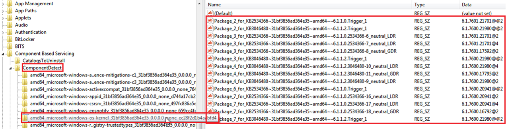
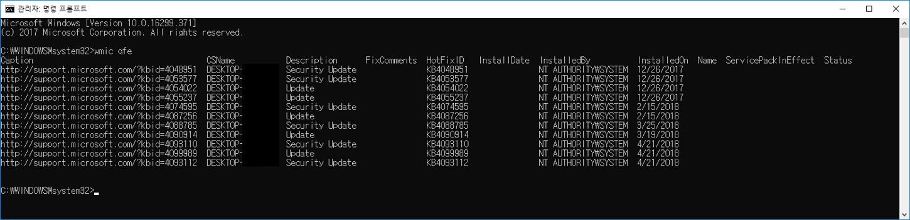
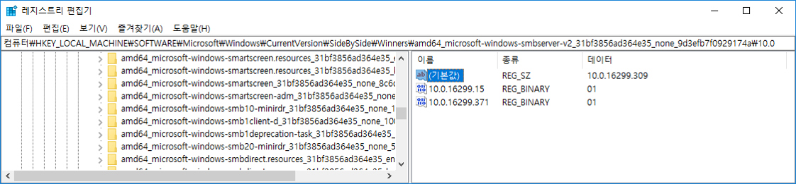
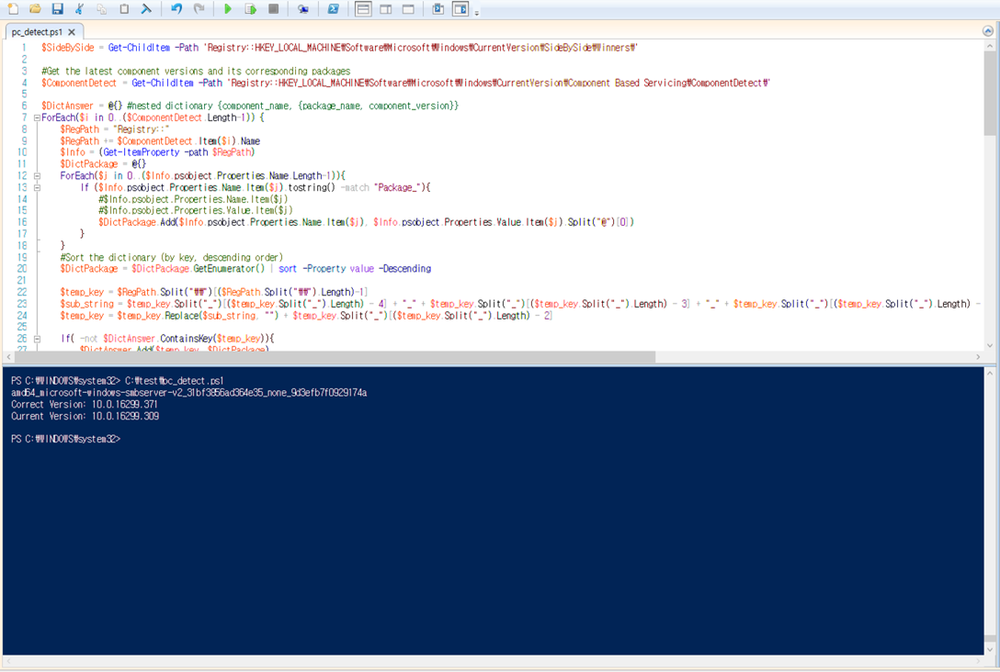

# 1. Notice
Update-State-Checker is a proof-of-concept to detect the package-component mismatch issue will be introduced in DIMVA 2018.

## 1.1. Papers and Presentations
They will be released after being published in DIMVA 2018.

## 1.2. Contributions
We always welcome your contributions. Issue report, bug fix, new feature implementation, anything is alright. Feel free to send us. 

## 1.3. License
Update-State-Checker has dual license, GPL v2 and MIT. You can choose any license you want.

# 2. Introduction of Update-State-Checker
Update-State-Checker solves some of the issues caused by problems of the Windows update management mechanisms. We introduce the problems of the current Windows update management and Update State Check scheme that detects the package-component mismatch. We stress that Update State Check scheme should be deployed immediately to mitigate large-scale exploitation of the identified problems.

## 2.1. Proplems of Windows Update Management
The package-component mismatch and the blind spot issue are the first structural problems in the Windows update management mechanism that have not been reported. We outline the concept of a package-component mismatch and two types of blind spots of Windows update management and reveal the potential threats associated with them. The blind spot issue occurs because Windows does not care about the consistency between update packages and components installed on the system. These issues affect all server and desktop platforms.  
  
We briefly describe the problems. See the paper for details :)
### 2.1.1. Package-Component Mismatch
- We define it as..  
A state in which a part of component is different from the system that is usually updated
- What (or Who) cause it?  
An error that corrupts the component files or the registry settings  
An attacker who alters the component resources (with administrative privileges)  
- The result from the package-component mismatch  
A part of the components can be replaced with the previous versions that contain known vulnerabilities. At the same time, the update history remains unchanged.  

### 2.1.2. Blind Spot Issues
- After things going..  
There is nothing to diagnose the package-component mismatch.  
- Two types of blind spots  
(Type Ⅰ) The system loads the components that do not match the current update state  
(Type Ⅱ) The system does not provide a means to detect update status abnormalities
 
 ## 2.2. Update State Check Scheme
The blind spot issue can be resolved by mutually verifying the package information and component information. We were able to extract package-component mapping information from the registry settings scattered inside a local.
We also propose update state check scheme, which detects and corrects package-component mismatches by using the package-component mapping information.

### 2.2.1. Package-Component Mappings
The package-component mappings are the key information to solve the blind spot issue. The figure 1 shows the registry paths for package-component mappings, where it can be determined which version of a particular component belongs to which update package.  

<em>figure 1. Registry Settings for Package-Component Mappings</em> 

### 2.2.2. Detecting the Package-Component Mismatches
The following information is required:
- The list of package-component mappings  
  (A record set of [Package Name | Component Name | Component Version])
- Component Information (name, version)
- Package Information (name, installation status)
  
Based on the list of package-component mappings, we describes the following procedure of a detection scheme:   
1. List the installed packages on the system  
2. Check the package-component mappings  
3. Verify the hardlink information of components  
  
# 3. Generating a Pacakge-Component Mismatch
We provide a simple way to generate a package-component mismatch. We tested it on a Windows 10 64-bits desktop. Figure 2 shows the update packages installed on the system.  

<em>figure 2. Packages Installed on the System </em>  
  
The built-in tool, System File Checker (SFC) detects and repairs component damages based on specific registry values. The figure 3 shows an example of modifying registry values to revert component "amd64_microsoft-windows-smbserver-v2" to a previous version.

<em>figure 3. An Example of Component Resource Modification</em>  
  
We changed the default value from 10.0.16299.371 to 10.0.16299.309. Then open the cmd window and run "SFC /SCANNOW" with an administrator privilege. When the component replacement is completed by the SFC, perform a reboot. Finally, the component will revert to version 10.0.16299.309. (This version is not known to have a vulnerability. It was done just for testing.)

# 4. Run Update-State-Checker !
We provide Update-State-Checker written in PowerShell based on the detection scheme.  
(See the script "pc_detect.ps1".)

After tampering the component "amd64_microsoft-windows-smbserver-v2", We ran the Update-State-Checker. The execution result is shown in the figure 4.  

<em>figure 4. The Execution Result</em>  
  
The execution result tells you that the correct version of the component "amd64_microsoft-windows-smbserver-v2" is 10.0.16299.371, but now consists of 10.0.16299.309.

# 5. Research Note
Here we describe the meaning of the registry locations based on observations.

## 5.1. ComponentDetect
It is located in "HKEY_LOCAL_MACHINE\Software\Microsoft\Windows\CurrentVersion\Component Based Servicing\ComponentDetect\".  
When an update package is installed, updated component names are registered as subkeys in the corresponding location. Also, package names and versions of the component installed are registered as data names and values. Not every component name is registered as a subkey for that path. See figure 1 for example.  
In our detection script, we use ComponentDetect to identify package-component mappings.

## 5.2. SideBySide
It is located in "HKEY_LOCAL_MACHINE\Software\Microsoft\Windows\CurrentVersion\SideBySide\".  
Under the "Winners," all component names installed on the system are registered as subkeys. Also, the version number of the currently installed component is recorded under the corresponding subkey.  
The key-values at this location play a decisive role in the component configuration. As noted in the paper, the SFC detects whether a component is corrupt based on the current component version name of the path.
